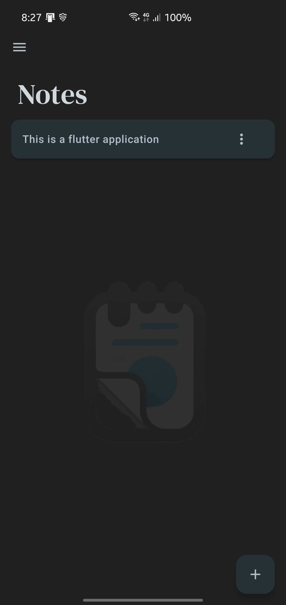
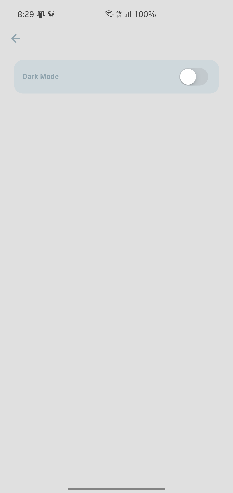

# Notes App

A simple and intuitive Notes App built with Flutter, designed to help you manage your notes efficiently. This app allows you to create, edit, and delete notes with a user-friendly interface and offers features like dark mode, light mode, and responsive design.

## Features

- **Create, Edit, and Delete Notes:** Easily manage your notes with a simple and clean UI.
- **Dark Mode and Light Mode:** Switch between themes to suit your environment.
- **Responsive Design:** Enjoy a consistent experience across devices with adaptive layouts.
- **Confirmation Dialog:** Get user confirmation before deleting a note to prevent accidental deletions.

## Screenshots

### Light Mode


### Dark Mode



### Add Note


### Update Note


### Delete Confirmation


### Settings



### Drawer


## Installation

Follow these steps to get the app up and running on your local machine.

### Prerequisites

- [Flutter](https://flutter.dev/docs/get-started/install) (version 3.10.0 or higher)
- [Dart](https://dart.dev/get-dart)
- Android/iOS Emulator or a physical device

### Steps

1. **Clone the Repository:**
   ```sh
   git clone <repository-url>
   cd notes_application
2. **Install Dependencies:**
   ```sh
   flutter pub get
3. **Run The App:**
   ```sh
   flutter run

## Usage

1. **Launch the app** on your device or emulator.
2. **Create a new note** by tapping the "+" icon.
3. **Edit a note** by tapping on 3 dots and making changes.
4. **Delete a note** by tapping on 3 dots followed by confirming the deletion.

